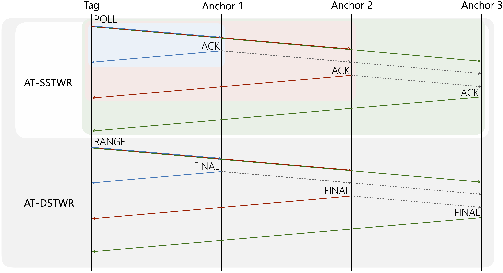
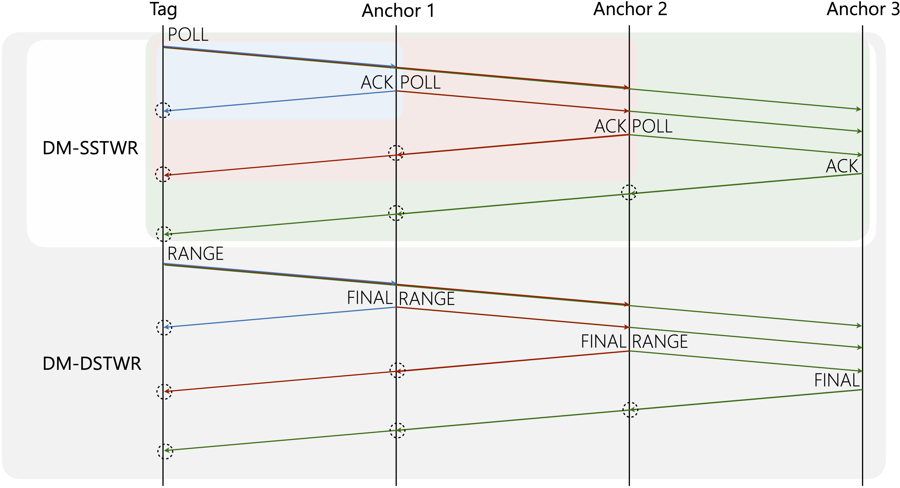

# ESP32 UWB DW3000 (under development)

The DW3000 library in this repository was developed by NConcepts.

This project uses MakerFabs DW3000 UWB ESP32 modules.

## Description

Anchor-tag (AT): measuring the distance from one tag to multiple anchors


Distance-matrix (DM): measuring the distance matrix among all nodes


```bash
src
├── at_dstwr  # Anchor tag: double-sided two way ranging
│   ├── main.cpp  # setup() and loop()
│   ├── uwb.cpp  # ranging protocal
│   └── uwb.h  # constants, declaration
├── at_sstwr # Anchor tag: single-sided two way ranging
│   ├── main.cpp
│   ├── uwb.cpp
│   └── uwb.h
├── dm_dstwr  # Distance matrix: double-sided two way ranging
│   ├── main.cpp
│   ├── uwb.cpp
│   └── uwb.h
├── dm_sstwr  # Distance matrix: single-sided two way ranging
│   ├── main.cpp
│   ├── uwb.cpp
│   └── uwb.h
└── platformio.ini
```

## Getting started

1. Clone the repository onto your local system.
2. Connect the ESP32 UWB3000 and modify `upload_port` and `monitor_port` in `platformio.ini`.
    > U1 is the initiator
    - AT: `env:at_sstwr/dstwr_u<1-6>`. 
    - DM: `env:dm_sstwr/dstwr_u<1-6>`
3. Modify `NUM_NODES` and `INTERVAL` in `uwb.h`
4. Upload the code `pio run -e <env name>` to each device
